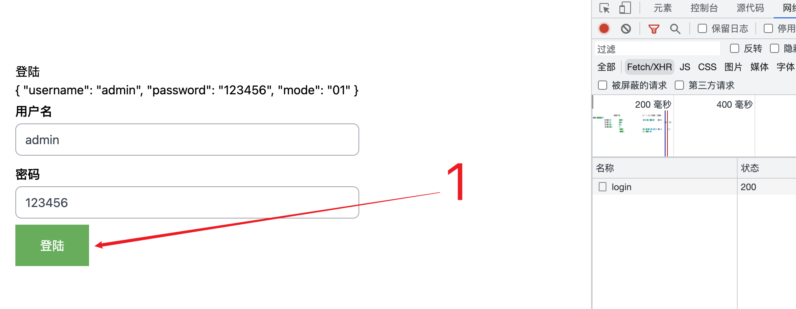
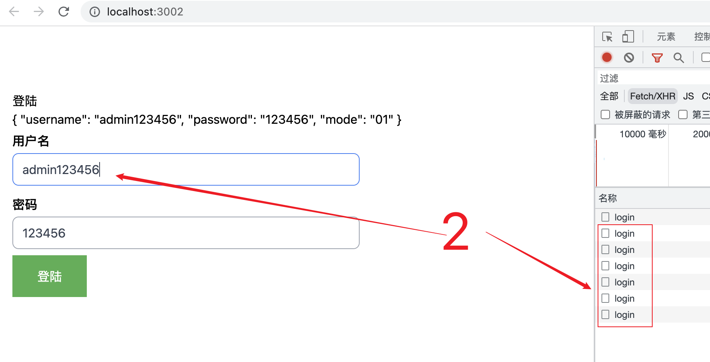

# Nuxt 3 Minimal Starter

Look at the [Nuxt 3 documentation](https://nuxt.com/docs/getting-started/introduction) to learn more.

## bug

useFetch(url,form)执行一次post请求后，form中数据发生变化时，useFetch(url,form)会重复执行多次





## Setup

Make sure to install the dependencies:

```bash
# yarn
yarn install

# npm
npm install

# pnpm
pnpm install --shamefully-hoist
```

## Development Server

Start the development server on http://localhost:3000

```bash
npm run dev
```

## Production

Build the application for production:

```bash
npm run build
```

Locally preview production build:

```bash
npm run preview
```

Check out the [deployment documentation](https://nuxt.com/docs/getting-started/deployment) for more information.
